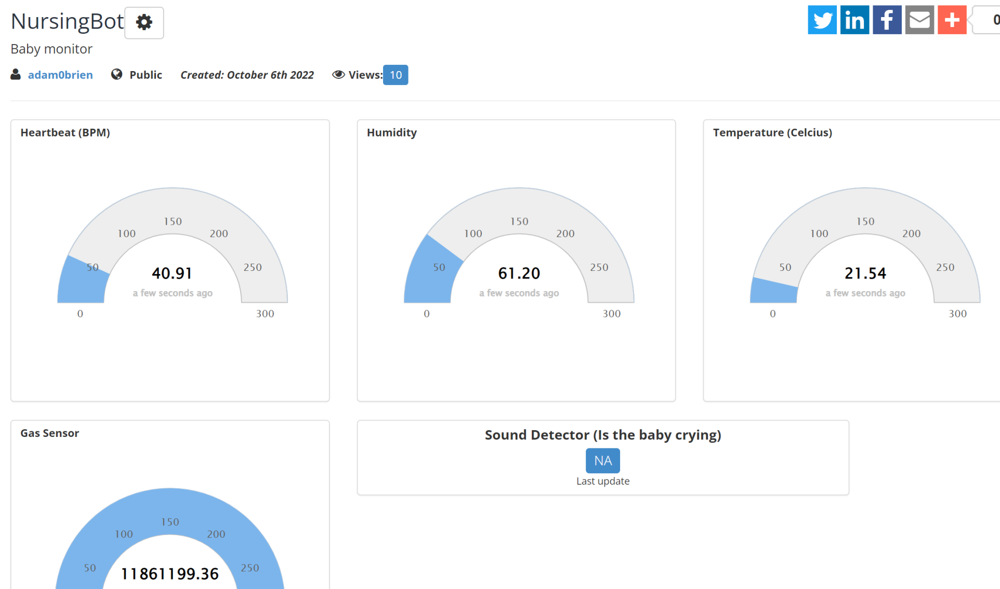

# NurseBot-V1.0
IoT solution for the medical industry

This project is an IoT solution to support the fast-paced medical industry, the main objective of this project is to make looking after new-born babies as easy as possible on nurses, 

The main function of this automated system is to take readings of the infant’s surroundings and report them to the cloud, it will also monitor the babies’ vital signs like its heartbeat and temperature
The following sensors are included in this design
•	BME 680 (for temperature, humidity and air quality
•	A pulse sensor to calculate the new-borns BPM and report to the cloud
•	A noise sensor that will detect if the baby is in distress, this will then send an automated text message to the on-duty nurse.

It is fully powered by a raspberry pi,and the full circuitry will be reduced to a PCB later on in order to reduce the overall size it will take up, the PCB also reduces the number of physical wires in the circuit which will in turn make it safer.

      

Below is the dashboard i created using Beebotte, It displays all vital signs/data of the child

As of right now the wiring is very messy as its in the early stages but this will be reduced to a PCB in the comming weeks

