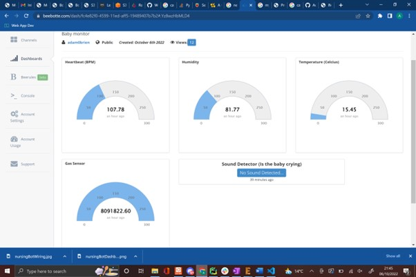
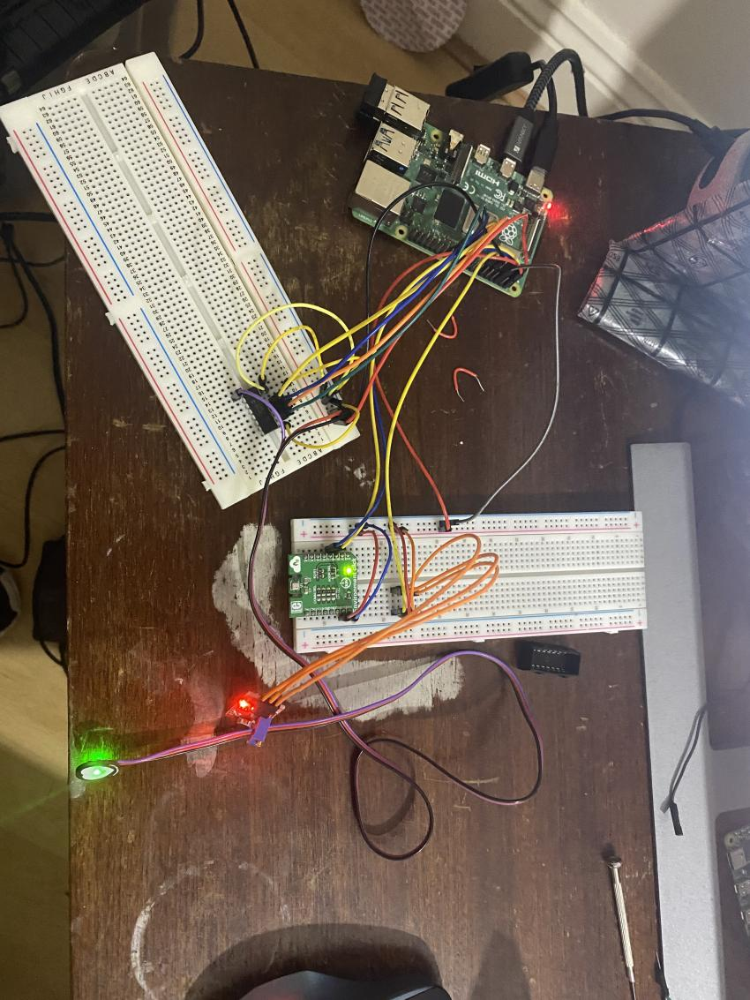
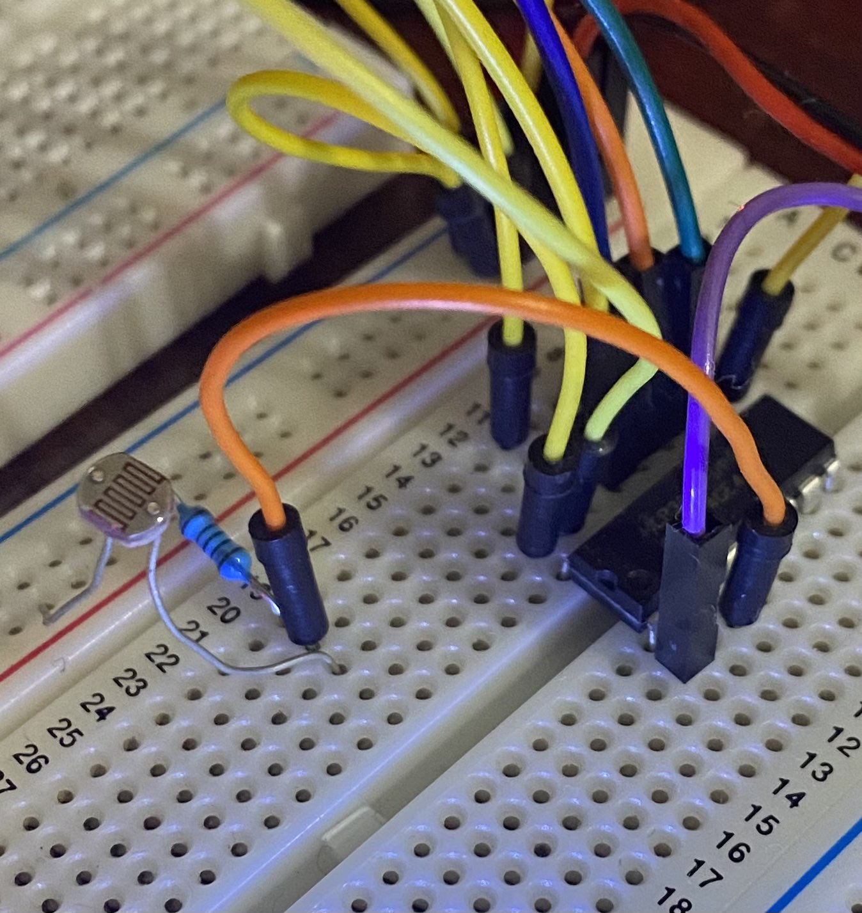
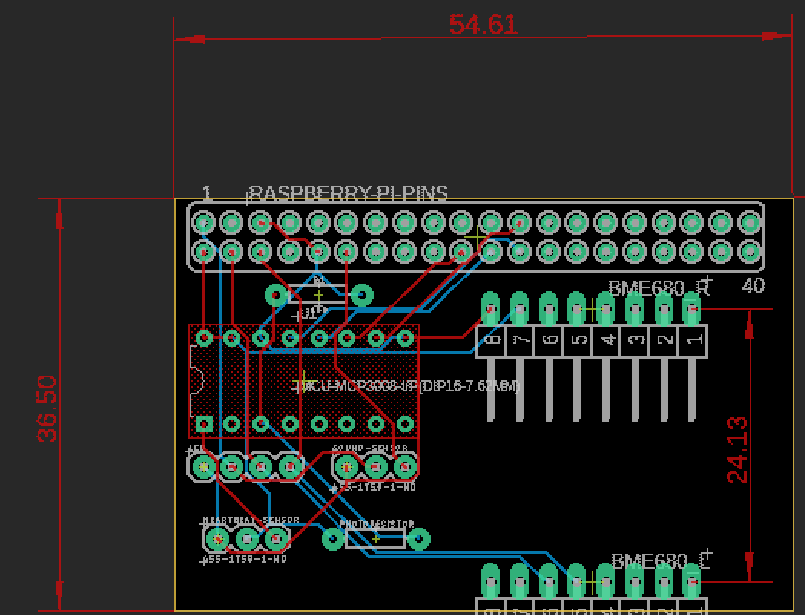
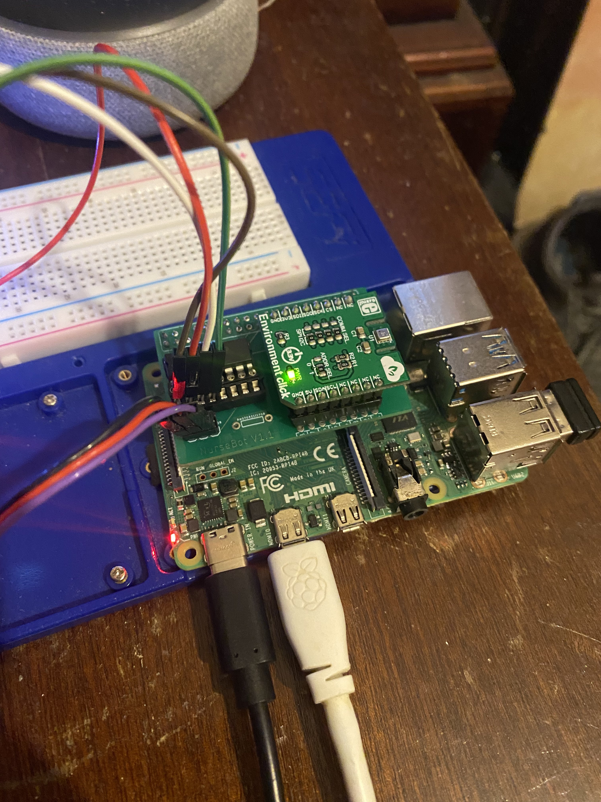
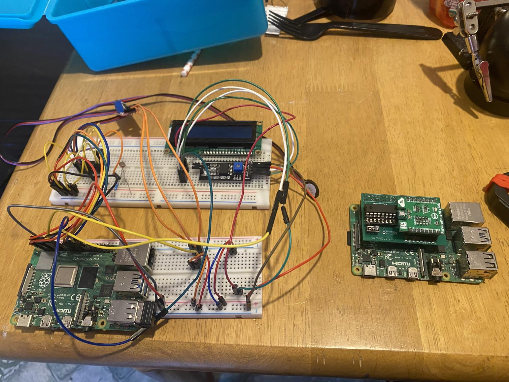
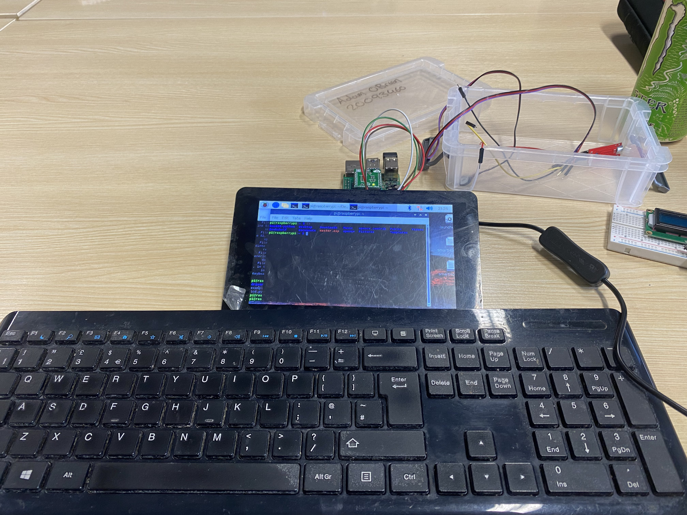

# NurseBot-V1.0
# IoT solution for the medical industry

This project is an IoT solution to support the fast-paced medical industry, the main objective of this project is to make looking after new-born babies as easy as possible on nurses, 

The main function of this automated system is to take readings of the infant’s surroundings and report them to the cloud, it will also monitor the babies’ vital signs like its heartbeat and temperature
The following sensors are included in this design
 
•	BME 680 (for temperature, humidity and air quality
 
•	A pulse sensor to calculate the new-borns BPM and report to the cloud
 
•	A noise sensor that will detect if the baby is in distress, this will then send an automated text message to the on-duty nurse.
 

It is fully powered by a raspberry pi,and the full circuitry will be reduced to a PCB later on in order to reduce the overall size it will take up, the PCB also reduces the number of physical wires in the circuit which will in turn make it safer.

   
# Beebotte Dashboard
Below is the dashboard i created using Beebotte, It displays all vital signs/data of the child

# Proof of concept
As of right now (week 4) the wiring is very messy as its in the early stages but this will be reduced to a PCB in the comming weeks

# Week 5

As of week 5 the lcd screen has been connected using i2c, so now the bme680 and the lcd screen are both using lcd on the same channel. This wont cause any problems because i2c is a shared bus, multiple devices are allowed, as long as no two devices share the dame i2c address.

# Week 6

At the start of week 6 i added an LDR(light dependant resistor) to my circuit and connected it to the MCP3008 so i can find out what light level is present around the infant this will be monitoring.

 
 

Along with the LDR i also finished designing the schematic that will be used to make the PCB for this project, the goal here is to have a small board about the same size as the raspberry pi that will simply sit on top of it, similar to the Sense HAT

# Week 9 (PCB Week)

In week 9 the board arrived and was soldered together

Here is a comparison of the original wiring and the new PCB (Nurse Hat)

The NurseHats I2C connections can also be used on a touch screen display,lcd screen (or any other I2C device) 

live readings
https://beebotte.com/dash/fc4e82f0-4599-11ed-aff5-19489407b7b2#.Y06nvnbMLD4
